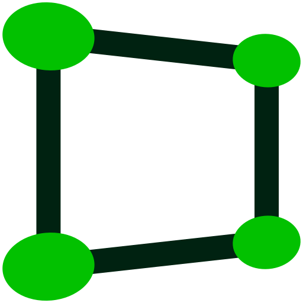

<h1 style="
  display: inline-block !important;
  font-size: 3rem;
">
  
  <span style="position: relative; bottom: 0.7rem;">
    Perspec
  </span>
</h1>

App and workflow to perspectively correct images.
For example whiteboards, document scans, or facades.


## App Workflow

Step | Description                          | Result
-----|--------------------------------------|--------
1    | Take a photo                         | ![Original image][doc]
2    | Open Perspec                         | ![Opened Perspec App][open]
3    | Drop the image file onto the window  | ![Dropped image][dropped]
4    | Mark the corners by clicking on them | ![Marked corners][corners]
5    | Press enter                          | ![Corrected image][fixed]

[doc]: images/doc.jpg
[mark]: images/doc-marking.jpg
[open]: images/perspec_opened.png
[dropped]: images/perspec_image_dropped.png
[corners]: images/perspec_marked_corners.png
[fixed]: images/doc-fixed.jpg


## Installation

### Prebuilt

#### MacOS

Install it via my [Homebrew](https://brew.sh) tap:

```sh
brew install --cask ad-si/tap/perspec
```

You can also get this (and previous) versions from
[the releases page](https://github.com/ad-si/Perspec/releases).

The current nightly version can be downloaded from
https://github.com/ad-si/Perspec/actions.
However, it's necessary to fix the file permissions after download:

```sh
chmod +x \
  ./Perspec.app/Contents/MacOS/Perspec \
  ./Perspec.app/Contents/Resources/{perspec,script,imagemagick/bin/convert}
```


### From Source

Build it from source with Haskell's
[stack](https://docs.haskellstack.org/en/stable/install_and_upgrade/).

```sh
git clone https://github.com/ad-si/Perspec
cd Perspec
make install
```

This copies the `Perspec.app` to your `/Applications` directory
and makes the `perspec` command available on your path.
You can then either drop images on the app window,
or use it via the CLI like `perspec image.jpg`


## Manual

### Interpolation of Missing Parts

Perspect automatically interpolates missing parts by using the closest pixel.
(https://www.imagemagick.org/Usage/misc/#edge)


### Usage via CLI

It's also possible to directly invoke Perspec via the CLI like so:

```sh
/Applications/Perspec.app/Contents/Resources/perspec path/to/image.jpeg
```

You can also pass several images and they will all be opened
one after another.
This is very useful for batch correcting a large set of images.


### Photo Digitalization Workflow

1. Take images
    1. Use camera app wich lets you lock rotation (e.g. [OpenCamera]).
      Otherwise check out the guide below to fix rotation.
1. Use `number-files-{even,odd,reversed}` commands to fix order and names
1. Verify that
    - All pages were captured and have the correct filename
    - Images are sharp enough
    - Images have a high contrast
    - Images have correct orientation
1. Convert images to lossless format, apply rotations
  and convert them to grayscale.
  Attention: Exclude the covers!
    ```sh
    mogrify -verbose -format png -auto-orient -colorspace gray ./*.jpg
    ```
1. Use Perspec to crop images
1. Normalize dynamic range:
    ```sh
    mogrify -verbose -normalize ./*.png
    ```
1. Convert to black and white:
    ```sh
    #! /usr/bin/env bash

    find . -iname "*.png" | \
    while read -r file
    do
      convert \
        -verbose \
        "$file" \
        \( +clone -blur 0x60 -brightness-contrast 40 \) \
        -compose minus \
        -composite \
        -negate \
        -auto-threshold otsu \
        "$(basename "$file" ".png")"-fixed.png
    done
    ```

[OpenCamera]:
  https://play.google.com/store/apps/details?id=net.sourceforge.opencamera


In order to rotate all photos to portrait mode you can use
either
```sh
mogrify -verbose -auto-orient -rotate "90>" ./*.jpg
```
or
```sh
mogrify -verbose -auto-orient -rotate "-90>" ./*.jpg
```

### Technology

The core is written in [Haskell](https://haskell.org),
for the perspective transformation it uses ImageMagick,
and the app bundle is created with [Platypus](https://sveinbjorn.org/platypus).


#### Underlying Imagemagick Commands

Once the corners are marked, the correction is equivalent to:

```sh
convert \
  images/example.jpg \
  -distort Perspective \
    '8,35 0,0 27,73 0,66 90,72 63,66 67,10 63,0' \
  -crop 63x66+0+0 \
  images/example-fixed.jpg
```


## Development

### TODO

- [ ] "Skip" button
- [ ] "Reset" button
- [ ] "Submit" button
- [ ] Label corner markers
- [x] Rescale image on viewport change
- [x] Handle JPEG rotation
- [ ] Manual rotation buttons
- [ ] Zoom view for corners
- [ ] Drag'n'Drop for corner markers
- [ ] "Convert to Grayscale" button
- [ ] Add support for custom output size (e.g. A4)
- [x] Draw lines between corners to simplify guessing of clipped corners
- [x] Bundle Imagemagick
- [x] Better error if wrong file format is dropped (images/error-message.jpg)


### Benchmarking

Use the `-bench` flag to benchmark Imagemagick operations.
For example:

```sh
convert \
  doc.jpg \
  -bench 50 \
  -virtual-pixel black \
  -define distort:viewport=1191x598+0+0 \
  -distort Perspective \
    '277,181 0,0 214,776 0,598 1405,723 1191,598 1256,175 1191,0' \
  +repage \
  doc-fixed.jpg
```


### Generate Icons

With <https://gist.github.com/zlbruce/883605a635df8d5964bab11ed75e46ad:>

```sh
svg2icns icon.svg
```


## Related

Check out [ad-si/awesome-scanning](https://github.com/ad-si/awesome-scanning)
for an extensive list of related projects.
