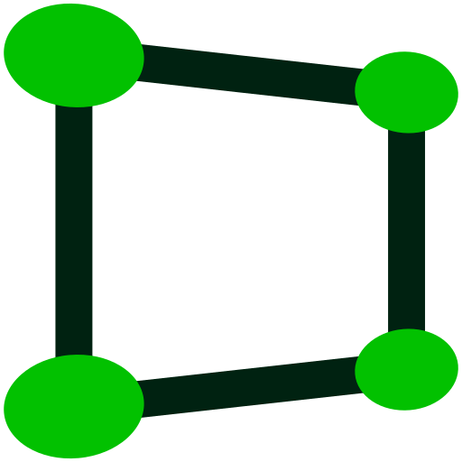
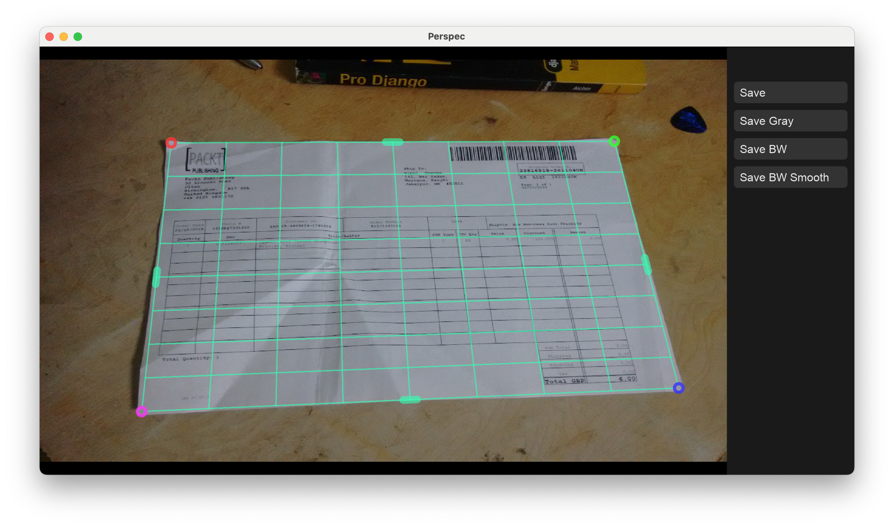
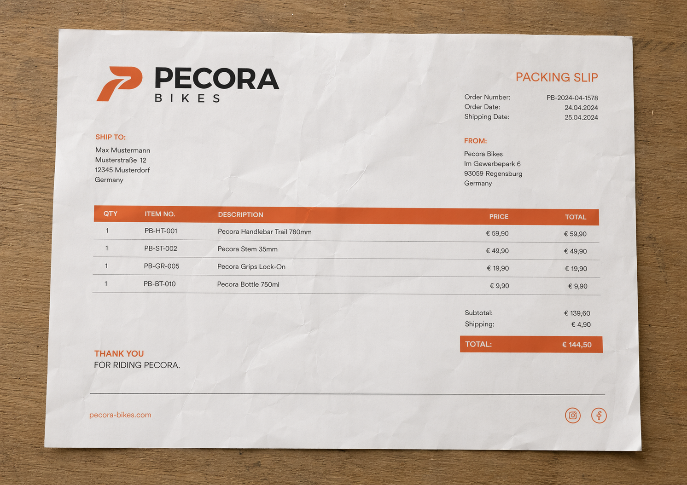
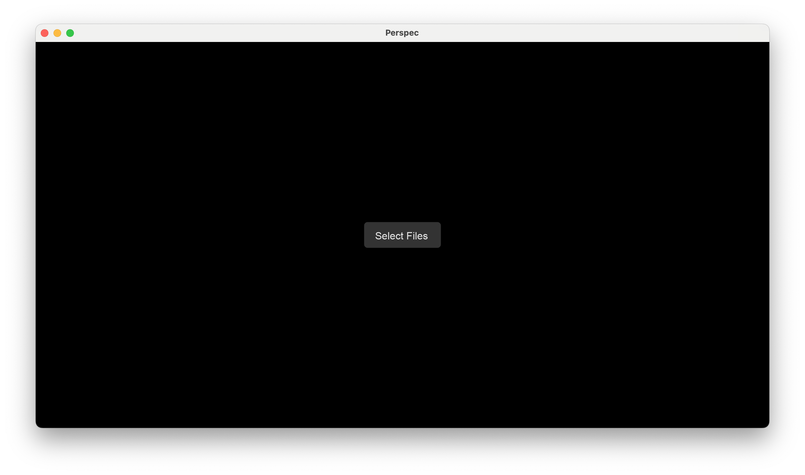
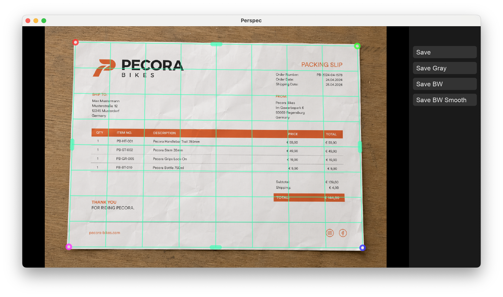
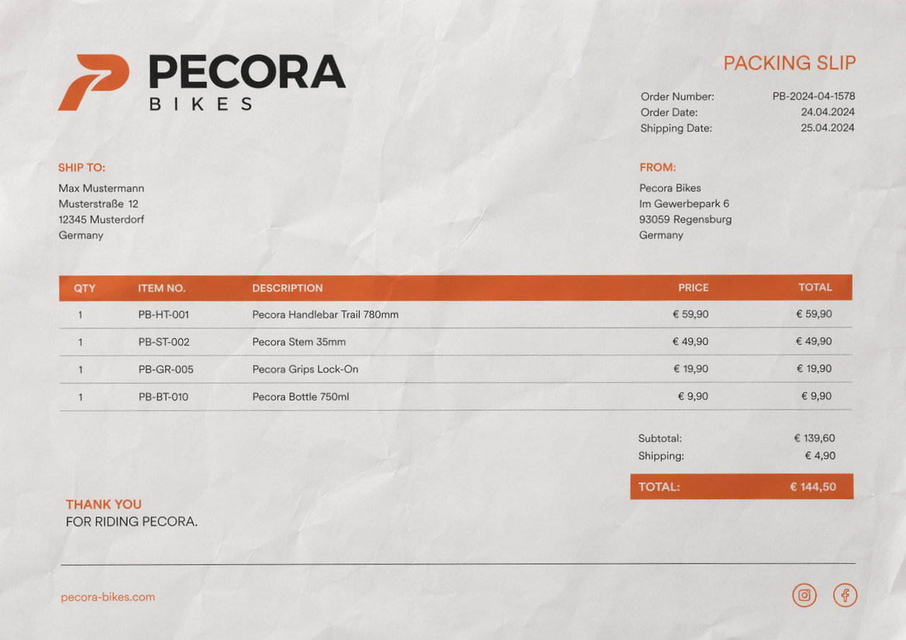
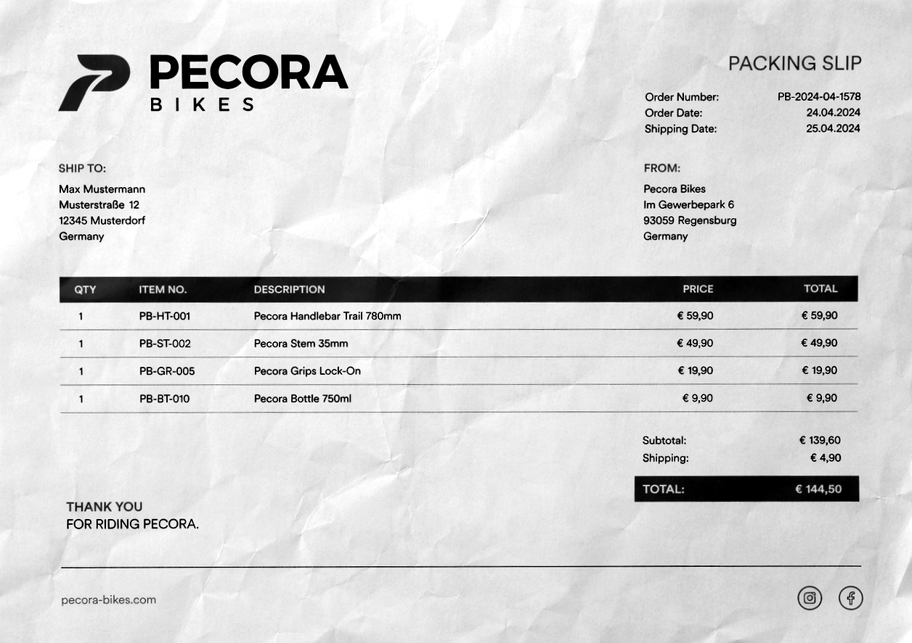
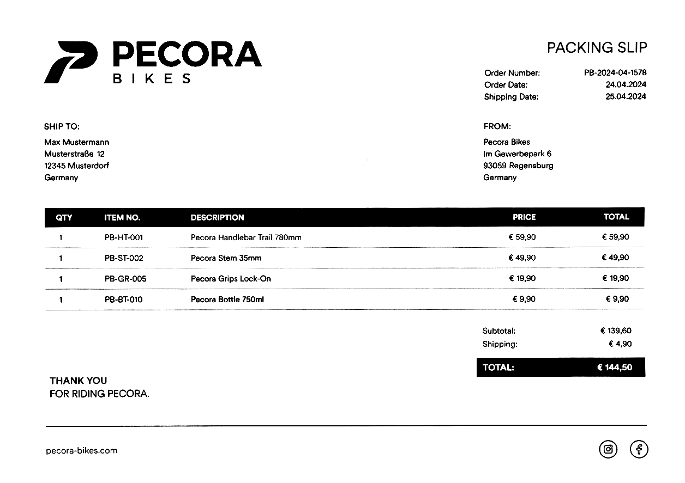

<h1 style="
  display: inline-block !important;
  font-size: 3rem;
">
  
  <span style="position: relative; bottom: 0.7rem;">
    Perspec
  </span>
</h1>

App and workflow to perspectively correct images.
For example whiteboards, document scans, or facades.



---

<!-- toc -->

- [App Workflow](#app-workflow)
- [Installation](#installation)
  * [Prebuilt](#prebuilt)
  * [From Source](#from-source)
- [Usage via CLI](#usage-via-cli)
- [Photo Digitization Workflow](#photo-digitization-workflow)
  * [Additional Steps](#additional-steps)
- [Features](#features)
- [Algorithms](#algorithms)
  * [Perspective Transformation](#perspective-transformation)
  * [Grayscale Conversion](#grayscale-conversion)
  * [BW Conversion](#bw-conversion)
  * [Interpolation of Missing Parts](#interpolation-of-missing-parts)
- [Technologies](#technologies)
- [Related](#related)

<!-- tocstop -->


## App Workflow

### 1. Take photos

Perspec is great for correcting photos of documents, receipts,
whiteboards, facades, or any other planar objects.




### 2. Open Perspec app




### 3. Select photos to correct

Either use the "Select Files" button or simply drag & drop the photos onto the window.

Perspec's integrated computer vision algorithms will automatically detect
the corners of the document and mark them with circles.

```text
    Red o----------------o Green
        |                |
        |    Document    |
        |                |
Magenta o----------------o Blue
```

If the corners are not detected correctly,
you can manually drag the circles or the edges to the correct position.




### 4. Save the corrected image

Either click one of the save buttons or hit Enter to save the corrected image.

This will save the image in the same directory
as the original photo with `-fixed` appended to the filename.

If you selected multiple photos, they will be opened one after another.

<table>
  <thead>
    <tr>
      <th>Button</th>
      <th>Description</th>
      <th>Result</th>
    </tr>
  </thead>
  <tbody>
    <tr>
      <td><code>Save</code></td>
      <td>Saves the image in 24-bit color.</td>
      <td></td>
    </tr>
    <tr>
      <td><code>Save Gray</code></td>
      <td>Saves the image in 8-bit grayscale and normalizes the range of values.</td>
      <td></td>
    </tr>
    <tr>
      <td><code>Save BW</code></td>
      <td>Saves the image in true 1-bit black &amp; white (each pixel is either black or white).</td>
      <td></td>
    </tr>
    <tr>
      <td><code>Save BW Smooth</code></td>
      <td>Saves the image in mostly black &amp; white with some grayscale edge smoothing. This is the recommended option for documents, receipts, and whiteboards.</td>
      <td></td>
    </tr>
  </tbody>
</table>


## Installation

### Prebuilt

You can get the current and previous versions from
[the releases page](https://github.com/feramhq/Perspec/releases).

The current nightly version can be downloaded at
[feramhq/Perspec/actions](https://github.com/feramhq/Perspec/actions).
However, it's necessary to fix the file permissions after download:

```sh
chmod +x \
  ./Perspec.app/Contents/MacOS/Perspec \
  ./Perspec.app/Contents/Resources/{perspec,script}
```

On macOS you can also install it via this [Homebrew](https://brew.sh) tap:

```sh
brew install --cask ad-si/tap/perspec
```


### From Source

Build it from source with Haskell's
[stack](https://docs.haskellstack.org/en/stable/install_and_upgrade/).

Platypus, with
[command line tools enabled](https://github.com/sveinbjornt/Platypus/blob/master/Documentation/Documentation.md#show-shell-command)
, is required to build from source.

```sh
git clone https://github.com/feramhq/Perspec
cd Perspec
make install
```

This copies the `Perspec.app` to your `/Applications` directory
and makes the `perspec` command available on your path.
You can then either drop images on the app window,
or use it via the CLI like `perspec fix image.jpeg`


## Usage via CLI

It's also possible to directly invoke Perspec via the CLI like so:

```sh
/Applications/Perspec.app/Contents/Resources/perspec fix path/to/image.jpeg
```

You can also pass several images and they will all be opened
one after another.
This is very useful for batch correcting a large set of images.


## Photo Digitization Workflow

1. Take photos
    1. Use camera app which lets you lock rotation (e.g. [OpenCamera]).
      Otherwise check out the guide below to fix rotation.
    1. Use a sound activated camera to take photos simply
      by clicking your tongue or snipping your finger. E.g. with:
      - [Pluto Trigger] - Hardware device
      - [Magic Lantern] - 3rd party firmware for Canon
      - [iSoundCam] - Android app
1. Use `perspec rename` sub-command to fix order and names of scanned files.
1. Verify that
    - All pages were captured and have the correct filename
    - Images are sharp enough
    - Images have a high contrast
    - Images have correct orientation
1. For best image quality convert images optionally
  to a lossless format (e.g. `png`),
  apply rotations, and convert them to grayscale.
  Attention: Exclude the covers!
    ```sh
    mogrify -verbose -format png \
      -auto-orient -colorspace gray photos/*.jpeg
    ```
1. Use Perspec to crop images
    ```sh
    perspec fix photos/*.png
    ````

[iSoundCam]: http://www.cherry-software.com/isoundcam.html
[Magic Lantern]: https://wiki.magiclantern.fm/pl:userguide?#audio_remoteshot
[OpenCamera]:
  https://play.google.com/store/apps/details?id=net.sourceforge.opencamera
[Pluto Trigger]: https://plutotrigger.com


### Additional Steps

Improve colors with one of the following steps:

1. Normalize dynamic range:
    ```sh
    mogrify -verbose -normalize photos/*.png
    ```
1. Convert to black and white:
    ```sh
    #! /usr/bin/env bash

    find . -iname "*.png" | \
    while read -r file
    do
      magick \
        -verbose \
        "$file" \
        \( +clone -blur 0x60 -brightness-contrast 40 \) \
        -compose minus \
        -composite \
        -negate \
        -auto-threshold otsu \
        "$(basename "$file" ".png")"-fixed.png
    done
    ```

In order to rotate all photos to portrait mode,
you can use one of the following commands:
```sh
mogrify -verbose -auto-orient -rotate "90>" photos/*.jpeg
mogrify -verbose -auto-orient -rotate "-90>" photos/*.jpeg
```


## Technologies

- Core is written in [Haskell](https://haskell.org)
- Image manipulation and computer vision are handled by [FlatCV](https://flatcv.ad-si.com)
- App bundle is created with [Platypus](https://sveinbjorn.org/platypus)


## Related

Check out [ad-si/awesome-scanning](https://github.com/ad-si/awesome-scanning)
for an extensive list of related projects.
